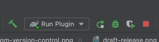

# Repo Depot

<!-- Plugin description -->
**Repo Depot** is a simple JetBrains plugin that lets teams share common bookmarks through source control and open them through their IDE.

Bookmarks are available under Tools: 

Nest and organize them in the Settings menu: 

Maintain them in the Settings UI: 

The menu configuration persists in a root-level file called `repo_depot.json`. If the file doesn't exist, it'll be created automatically. 

> **Note**
>
> Teams may want to exclude `repot_depot.json` from their CI/CD processes to quickly change their bookmarks via pull requests, without triggering long-running build validation processes. 

<!-- Plugin description end -->

## Development Notes

Development for this plugin requires the use of IntelliJ CE. We targeted Android Studio for testing, but other IDEs could be used. Inspired by the IntelliJ Platform Plugin Template. 

Run with the Run Plugin build config: 

## License

Distributed under the Apache License. See `LICENSE` for more information.

## Useful links

- [IntelliJ Platform SDK Plugin SDK][docs]
- [Gradle IntelliJ Plugin Documentation][gh:gradle-intellij-plugin-docs]
- [IntelliJ Platform Explorer][jb:ipe]
- [JetBrains Marketplace Quality Guidelines][jb:quality-guidelines]
- [IntelliJ Platform UI Guidelines][jb:ui-guidelines]
- [JetBrains Marketplace Paid Plugins][jb:paid-plugins]
- [Kotlin UI DSL][docs:kotlin-ui-dsl]
- [IntelliJ SDK Code Samples][gh:code-samples]
- [JetBrains Platform Slack][jb:slack]
- [JetBrains Platform Twitter][jb:twitter]
- [IntelliJ IDEA Open API and Plugin Development Forum][jb:forum]
- [Keep a Changelog][keep-a-changelog]
- [GitHub Actions][gh:actions]

[docs]: https://plugins.jetbrains.com/docs/intellij?from=IJPluginTemplate
[docs:intellij-platform-kotlin-oom]: https://plugins.jetbrains.com/docs/intellij/using-kotlin.html#incremental-compilation
[docs:intro]: https://plugins.jetbrains.com/docs/intellij/intellij-platform.html?from=IJPluginTemplate
[docs:kotlin-ui-dsl]: https://plugins.jetbrains.com/docs/intellij/kotlin-ui-dsl-version-2.html?from=IJPluginTemplate
[docs:kotlin]: https://plugins.jetbrains.com/docs/intellij/using-kotlin.html?from=IJPluginTemplate
[docs:kotlin-stdlib]: https://plugins.jetbrains.com/docs/intellij/using-kotlin.html?from=IJPluginTemplate#kotlin-standard-library
[docs:plugin.xml]: https://plugins.jetbrains.com/docs/intellij/plugin-configuration-file.html?from=IJPluginTemplate
[docs:publishing]: https://plugins.jetbrains.com/docs/intellij/publishing-plugin.html?from=IJPluginTemplate
[docs:release-channel]: https://plugins.jetbrains.com/docs/intellij/publishing-plugin.html?from=IJPluginTemplate#specifying-a-release-channel
[docs:using-gradle]: https://plugins.jetbrains.com/docs/intellij/developing-plugins.html?from=IJPluginTemplate
[docs:plugin-signing]: https://plugins.jetbrains.com/docs/intellij/plugin-signing.html?from=IJPluginTemplate
[docs:project-structure-settings]: https://www.jetbrains.com/help/idea/project-settings-and-structure.html
[docs:testing-plugins]: https://plugins.jetbrains.com/docs/intellij/testing-plugins.html?from=IJPluginTemplate

[gh:actions]: https://help.github.com/en/actions
[gh:build]: https://github.com/JetBrains/intellij-platform-plugin-template/actions?query=workflow%3ABuild
[gh:code-samples]: https://github.com/JetBrains/intellij-sdk-code-samples
[gh:dependabot]: https://docs.github.com/en/free-pro-team@latest/github/administering-a-repository/keeping-your-dependencies-updated-automatically
[gh:dependabot-pr]: https://github.com/JetBrains/intellij-platform-plugin-template/pull/73
[gh:gradle-changelog-plugin]: https://github.com/JetBrains/gradle-changelog-plugin
[gh:gradle-intellij-plugin]: https://github.com/JetBrains/gradle-intellij-plugin
[gh:gradle-intellij-plugin-docs]: https://plugins.jetbrains.com/docs/intellij/tools-gradle-intellij-plugin.html
[gh:gradle-intellij-plugin-runIde]: https://plugins.jetbrains.com/docs/intellij/tools-gradle-intellij-plugin.html#tasks-runide
[gh:gradle-intellij-plugin-runPluginVerifier]: https://plugins.jetbrains.com/docs/intellij/tools-gradle-intellij-plugin.html#tasks-runpluginverifier
[gh:gradle-qodana-plugin]: https://github.com/JetBrains/gradle-qodana-plugin
[gh:intellij-ui-test-robot]: https://github.com/JetBrains/intellij-ui-test-robot
[gh:kover]: https://github.com/Kotlin/kotlinx-kover
[gh:releases]: https://github.com/JetBrains/intellij-platform-plugin-template/releases
[gh:ui-test-example]: https://github.com/JetBrains/intellij-ui-test-robot/tree/master/ui-test-example

[gradle]: https://gradle.org
[gradle:build-cache]: https://docs.gradle.org/current/userguide/build_cache.html
[gradle:configuration-cache]: https://docs.gradle.org/current/userguide/configuration_cache.html
[gradle:kotlin-dsl]: https://docs.gradle.org/current/userguide/kotlin_dsl.html
[gradle:kotlin-dsl-assignment]: https://docs.gradle.org/current/userguide/kotlin_dsl.html#kotdsl:assignment
[gradle:lifecycle-tasks]: https://docs.gradle.org/current/userguide/java_plugin.html#lifecycle_tasks
[gradle:releases]: https://gradle.org/releases
[gradle:version-catalog]: https://docs.gradle.org/current/userguide/platforms.html#sub:version-catalog

[jb:github]: https://github.com/JetBrains/.github/blob/main/profile/README.md
[jb:download-ij]: https://www.jetbrains.com/idea/download
[jb:forum]: https://intellij-support.jetbrains.com/hc/en-us/community/topics/200366979-IntelliJ-IDEA-Open-API-and-Plugin-Development
[jb:ipe]: https://jb.gg/ipe
[jb:my-tokens]: https://plugins.jetbrains.com/author/me/tokens
[jb:paid-plugins]: https://plugins.jetbrains.com/docs/marketplace/paid-plugins-marketplace.html
[jb:qodana]: https://www.jetbrains.com/help/qodana
[jb:qodana-github-action]: https://www.jetbrains.com/help/qodana/qodana-intellij-github-action.html
[jb:quality-guidelines]: https://plugins.jetbrains.com/docs/marketplace/quality-guidelines.html
[jb:slack]: https://plugins.jetbrains.com/slack
[jb:twitter]: https://twitter.com/JBPlatform
[jb:ui-guidelines]: https://jetbrains.github.io/ui

[codecov]: https://codecov.io
[github-actions-skip-ci]: https://github.blog/changelog/2021-02-08-github-actions-skip-pull-request-and-push-workflows-with-skip-ci/
[keep-a-changelog]: https://keepachangelog.com
[keep-a-changelog-how]: https://keepachangelog.com/en/1.0.0/#how
[semver]: https://semver.org
[xpath]: https://www.w3.org/TR/xpath-21/
